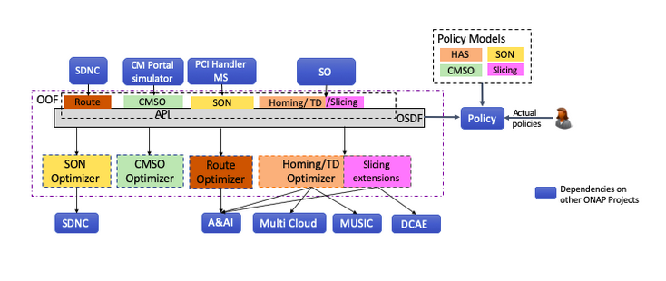

Working with OOF
-----------------

Understanding
--------------
Onap Optimization Framework (OOF) is required to provide the most optimized solution depending on the constraints given . Main component is a solver which will take in input data, constraints and the optimize parameter and give solutions accordingly.

Two types of solver supported in here which will be choosen depending on the application are:
1. Minizinc solver -
MiniZinc is a free and open-source constraint modeling language.
2. HAS solver -
HAS is a policy-driven placement optimizing service (component of OOF project)

The two main components of the oof project are
1. OSDF ( Optimization Service Design Framework) – This is the first thing which receives the request, and prepares the data to be given to solver,collects solution and publishes it. It is a model and policy-driven optimization framework depending on whether minizinc solver or has solver is called respectively.
2. Homing and Allocation Service (HAS)- Its policy driven platform. It is named as this because it was entirely dedicated to home the service components (eg :vnfs) such that it meets all the service requirements.

HAS architecture :

Setup OOF project
-----------------

.. code-block:: bash

 1. Clone has project - Link:-git clone https://gerrit.onap.org/r/optf/has
 2. Clone osdf project -Link:-git clone " https://gerrit.onap.org/r/optf/osdf"
 3. Clone oom project -Link:- git clone "https://gerrit.onap.org/r/aaf/oom"
 4. Clone sms project - link:- git clone https://gerrit.onap.org/r/aaf/sms
 HAS and OSDF are used for the functionality implementation. OOM and SMS projects are entirely  dedicated for the  authentication process
 5. Append at the end aaf-sms.onap to 127.0.0.1 locahost in /etc/hosts
    127.0.0.1       localhost  aaf-sms.onap
 6. cd sms/sms-service/bin/deploy
 7. If already containers are running then stop them   ./sms.sh stop.
 8. Then start SMS using    ./sms.sh start
 9. The following containers will be started which can be checked in using docker ps

 .. image:: ../images/docker.png

 10.After the docker containers are up, Copy the has.json and osdf.json from the OOM for setting up SMS
 docker exec --user root -i aaf-sms.onap /bin/sh -c "mkdir -p /preload/config"
 sudo docker cp has.json aaf-sms.onap:/preload/config/has.json
 sudo docker cp osdf.json aaf-sms.onap:/preload/config/osdf.json
 sudo docker exec -i aaf-sms.onap /bin/sh -c "/sms/bin/preload -cacert /sms/certs/aaf_root_ca.cer -jsondir /preload/config -serviceport 10443 -serviceurl https://aaf-sms.onap"
 sudo docker logs sms-vault(verify if the secrets have been loaded into vault [INFO ] core: successful mount: path=sms/has/ type=kv)

Note: 1- osdf.json and has.json path needs to be specified

Note: 2- osdf and has are present in path ===> oom/charts/aaf-sms/resources/config

Setup OSDF under the OOF project
--------------------------------

.. code-block:: bash

 After successful setting up of oof, osdf needs to be set up
 1.Create a virtual env (preferred sdk >=python3.5) and activate it by  
 source venv/bin/activate
 2. Go to osdf library and run (pip3 install -r requirement.txt)
 3. Run ./osdfapp.sh -x osdfapp.py
 We can assure that osdfapp is running with the following message:
 Running on http://0.0.0.0:8699/

Setup HAS under the OOF project
-------------------------------

1. Music is prerequisite for the working of HAS. If music is not running in any specified env, then run the music_script.sh which is present in the csit project. Running of the script will download all the dependencies .  Following docker containers will be running
410c8783b956        nexus3.onap.org:10001/library/zookeeper:3.4              "/docker-entrypoint.…"   13 minutes ago      Up 13 minutes       0.0.0.0:2181->2181/tcp, 0.0.0.0:2888->2888/tcp, 0.0.0.0:3888->3888/tcp                                     music-zk
2115ceb704b0        nexus3.onap.org:10001/onap/music/music:3.0.23            "tail -f /dev/null"      17 minutes ago      Up 17 minutes                                                                                                                  music-war
acf3d18084a0        nexus3.onap.org:10001/onap/music/cassandra_3_11:3.0.23   "docker-entrypoint.sh"   20 minutes ago      Up 20 minutes       0.0.0.0:7000-7001->7000-7001/tcp, 0.0.0.0:7199->7199/tcp, 0.0.0.0:9042->9042/tcp, 0.0.0.0:9160->9160/tcp   music-db

2. Onboard conductor to music
curl -vvvvv --noproxy "*" --request POST http://locaLhost:8080/MUSIC/rest/v2/admin/pnboardAppWithMusic -H "Content-Type:application/json" -H"Authorization:BasicY29uZHVjdG9yOmMwbmR1Y3Qwcg==" --data @onboard.json

onboard.json
{
"appname":  "conductor",
"userId": "conductor",
"isAAF": "false",
"password": "c0nduct0r"
} 

3. The env and port of music should be updated in conductor.conf file. And also set the replication factor accordingly. If music is setup in local ,then it will be 1.
server_url = http://0.0.0.0:8080/MUSIC/rest/v2
4. create virtual environment with preferred sdk>= python3.5 and activate it by source {virtual_environment_location}/bin/activate
5. Inside of /has/conductor folder:
python3 setup.py install
pip3 install -e .
6. In different tabs execute the following commands, as conductor-api,controller,solver,reservation and data needs to be set up.
conductor-api --port=8091 -- --config-file={conductor_conf_file_location}
conductor-controller --config-file={conductor_conf_file_location}
conductor-solver --config-file={conductor_conf_file_location}
conductor-reservation --config-file={conductor_conf_file_location}
conductor-data --config-file={conductor_conf_file_location}.

External dependencies:
-----------------------

Some APIs have external dependencies like configDbUrl in pci-optimization, and aaiUrl in RouteOptimization , and conductorUrl in homing .
These are in osdf_config.yaml. These url needs to be replaced with the working env and corresponding port.
If new policies needs to be added to osdf local for testing, then it's path needs to be added to common_config.yaml

Various services supported in by OOF:
--------------------------------------
#1. upload policy : curl  -X GET  http://0.0.0.0:8699/api/oof/loadmodels/v1 
policyPlatformUrlModelUpload and pathPolicyModelUpload needs to be updated in osdf_config.yaml

#2. placement api : it is used to find the best resource of the demand type(vnf or vg) , taking the constraints and the optimization into account
curl -v -H "Content-Type: application/json" -X POST  --data @placmnt.json -u test:testpwd http://0.0.0.0:8699/api/oof/v1/placement

#3. route optimization : it is used to find the most optimized route between the source and destination ports in the input
curl -v -H "Content-Type: application/json" -X POST  --data @routeOpt.json  http://0.0.0.0:8699/api/oof/route/v1

#4. nst selection : it is used to find the nst template that has all the parameters in the input json
curl -v -H "Content-Type: application/json" -X POST  --data @nst.json  http://0.0.0.0:8699/api/oof/v1/selection/nst

#5. pci optimization : it is used to assign a minimum set of pci values to the set of cells considering the elimination of collision and minimize of confusion

curl -v -H "Content-Type: application/json" -X POST --data @abc.json -u pci_test:pci_testpwd http://0.0.0.0:8699/api/oof/v1/pci

#6. nsi selection : it is used to select the nssi which satisfies all the parameter values
curl -v -H "Content-Type: application/json" -X POST  --data @nst.json  http://0.0.0.0:8699/api/oof/selection/nsi/v1

OOF communication with other ONAP components:
---------------------------------------------

#1. SO - OOF interaction: On a service creation, these OOF api's are mostly called by the SO in an closed loop.
Eg: the nsi selection is called by so 

#2. OSDF - Policy interaction: Depending on the servicetype, OSDF fetches a set of policies for each resource and forms the constraint parameter for the HAS to solve upon

  Foreg: For the placement request of vfw, these are set of policies required
        placement_policy_files_vfw:
            - Distance_vFW_1.json
            - hpa_policy_vFW_1.json
            - Placement_Optimization_1.json
            - QueryPolicy_vFW.json
            - vnfPolicy_vFW.json 

#3. OOF - AAI interaction: 

1)In route optimization, we are getting all the logical links from AAI.

2)In HAS, for a particular resource , we need to get the set of all candidates, and data component of HAS gets it from AAI.

#4. OSDF - HAS interaction: Here in placement , nsi and nst selection apis, HAS solver is used.
In OSDF, input to HAS is formed, which has parameters such as demands(resource name - vg), constraints (distance between customer location and vg be less than 1km) , optimization(minimize distance between customer location and vg). The call to HAS happens in OSDF via a post restcall on this url  http://0.0.0.0:8091/v1/plans .

In HAS, first the call reaches conductor-api , where a random id is created to identify this particular transaction, it iss updated in the music(db) and is returned as a sync response.
Then the translator takes the particular request, it validates the request that it contains only valid parameters, after which it is translated. The data part acquires the whole set of possible candidates for that particaule resource. The solver then solves on the constraints and optimization and gives the best candidate from the whole set.
The best candidate is got via a get rest call on http://0.0.0.0:8091/v1/plans/transactionid, which is also called in OSDF and final result is given.

 

 

