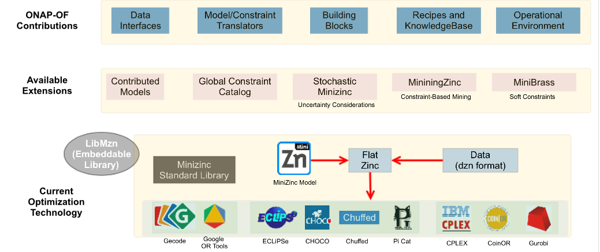

.. This work is licensed under a Creative Commons Attribution 4.0 International License.

Architecture
=============================================

Technology Choices
------------------
Minizinc provides an open source constraint modeling language/platform for specifying optimization applications. 
It contains direct interfaces to COIN-OR CBC, Gurobi and IBM ILOG CPLEX. Additionally, many optimization projects 
support minizinc via FlatZinc interfaces. The Minizinc standard library provides a subset of constraints form the  
global constraint catalogue as a high-level abstraction that have efficient algorithms implemented by several solvers.

Components of the Core Framework
--------------------------------------------

An overview of the components of the core optimization framework. The OOF utilizes the open source project Minizinc, 
which has a solver-independent modeling language and has interfaces to various open source and commercial solvers. 
One of the additional benefits of this approach is that by developing a focused set of ONAP-related components, 
we can utilize ongoing advances in optimization technologies, as well as adapt other currently available extensions to 
Minizinc and related projects. The OOF project aims to build these components with a focus on minimal viable product 
for Beijing Release in order to support initial applications and use cases, with subsequent focus on expanding the 
platform.

Data Adapter Library
----------------------

The OOF will provide a library of adapters for common ONAP systems. These can be directly used in data specification 
templates of the applications. In the initial release, these will include adapters to Policy, A&AI, Multi-Cloud, and 
SDC (additional "stretch goals" for this release include SDN-C, Microservice Bus). As new use cases are implemented, 
this library will be augmented by new adapters to other services. 

Translation Modules
--------------------------------------------

The OOF will provide modules for translating policies into constraints for the optimization environment. When an 
underlying minizinc model is used for optimization, it is translated into a minizinc constraint (either via a data 
specification template or directly from policy). For custom optimizers, these constraints will be translated to the 
input format expected by the optimizer via the data specification template. The Homing and Allocation Service (HAS; 
described in the next section) uses a custom optimization module and hence uses the data specification template approach.

Modeling Support
----------------------

The OOF provides simple templating system through which users can specify links to different ONAP components, including policy, 
A&AI, SDC, etc.

Execution Environment
------------------------------------------------------------------------

The OOF execution environment contains the minizinc system, along with data/template rendering system that leverages 
the adapters to various systems. The flow of execution can be configured via the configuration file for the application 
and supports a choice of specific solver or invocations to custom/external solvers. 
